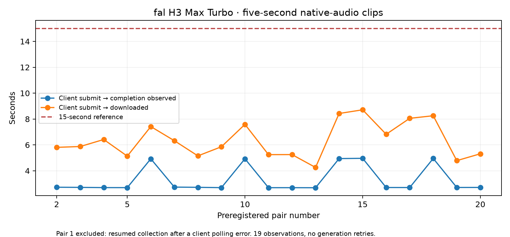

# Completed fal reference batch

All twenty preregistered H3 Max Turbo requests completed and their original videos were downloaded and fully decoded. There were zero generation failures and zero generation retries. Each response reports 8 billable units; the authenticated unit price was $0.0125, giving **$2.00 total**, or **$0.02 per requested video-second**. No account invoice was accessible; this amount is derived from provider-reported response units and the authenticated price.

For the nineteen requests with uninterrupted client observation, median submission-to-downloaded-file time was **5.876 seconds**, range **4.259–8.714 seconds**. Status was polled every two seconds, so observed completion time is quantized by that interval. Pair R0001 is retained for quality but excluded from this latency summary because of a client HTTP-202 polling bug; its resumed wall-clock observation took 78.730 seconds. See [deviations](../DEVIATIONS.md). This was one controller error, not a provider failure or a second generation.

All twenty native outputs are 1344 × 768, 124 frames at 24 fps, with audio. Video-stream duration is 5.166667 seconds and audio duration 5.184 seconds. Inputs requested five seconds, which is the cost normalization used here. The LTX profile requests 121 frames; outputs are not trimmed to conceal that difference.

[Raw allowlisted attempts](fal-attempts.json) retain input hashes, seeds, provider request IDs, queue observations, measured latency, billable units and artifact hashes. Credentials and signed URLs are excluded. [Machine summary](fal-summary.json) is reproducible with the included exporter. [All twenty original fal videos](https://github.com/Frozen/video-generation-cost-benchmark/releases/download/ltx-sustained-2026-09-21/fal-twenty-original-videos-20260921.zip) (118,806,517 bytes; SHA-256 `7c5bced55c26a4b4c50278cbb005bfe231955426acf4197d4ffd640565b85672`).

The LTX hour is still running. No cross-model quality parity or final cost ratio is concluded here.

Including the client polling interruption, all twenty observed download latencies have mean **9.972 seconds**, nearest-rank p95 **8.714 seconds** and maximum **78.730 seconds**. The full distribution is retained alongside the nineteen uninterrupted requests; the controller error is not erased.
