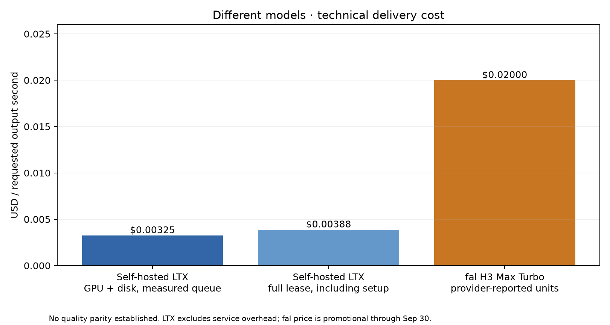
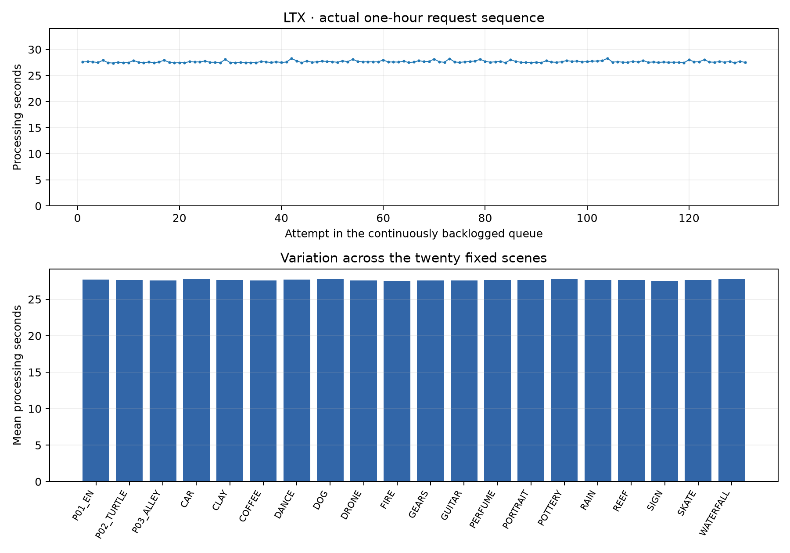

# One-hour LTX test: 6.15× cheaper generation than fal H3 Max Turbo

**131 clips. 20 scenes. 131 unique seeds. Zero failures. No meaningful slowdown.**

LTX generated five-second videos with sound for **$0.003253 per video-second**, compared with **$0.02** for fal H3 Max Turbo at the measured API price. The run lasted **60 minutes 22 seconds** on one RTX PRO 6000 96 GB at Runpod (EUR-IS-1). Every video is saved, along with its prompt, seed and generation settings.

## Downloads, exact inputs and reproduction

Everything needed to inspect this experiment is linked here:

- **[Download all 153 original videos and complete evidence (487 MB)](https://github.com/Frozen/video-generation-cost-benchmark/releases/download/ltx-sustained-2026-09-21/ltx-sustained-evidence-20260921.zip).** Includes 131 measured LTX clips, twenty fal references, two warmups, raw logs, exact prompts/seeds, per-video replay JSON, code and the pinned preparation source archive. Extract the entire archive and open `videos.html` to browse or search by request ID, scene, prompt or seed.
- **Exact video inputs:** [CSV catalog](VIDEO_CATALOG.csv), [JSON catalog](VIDEO_CATALOG.json), [actual LTX manifest](../evidence/ltx/resident.json), [registered scenes and prompts](../ltx-sustained-scenes.json), and [fixed generation plan](../ltx-sustained-plan.json). Catalog media paths are relative to the extracted archive.
- **Raw LTX evidence:** [all exported logs](../evidence/ltx), [request event journal](../evidence/ltx/events.jsonl), [download/decode receipts](../evidence/ltx/delivery.json), [worker log](../evidence/ltx/duration.log), [GPU telemetry](../evidence/ltx/gpu-samples.csv), and [hardware inventory](../evidence/ltx/hardware.json).
- **API evidence:** [all twenty fal attempts, statuses and billing units](fal-attempts.json), [summary and controller-error disclosure](FAL_RESULTS.md), and [download the twenty original fal videos (119 MB)](https://github.com/Frozen/video-generation-cost-benchmark/releases/download/ltx-sustained-2026-09-21/fal-twenty-original-videos-20260921.zip).
- **Quality comparison:** [download the forty-video randomized A/B review (175 MB)](https://github.com/Frozen/video-generation-cost-benchmark/releases/download/ltx-sustained-2026-09-21/ltx-fal-quality-review-20260921.zip), [review instructions](QUALITY_REVIEW.md), [frozen evaluation criteria](../ltx-sustained-criteria.json), and [limited sampled-frame screen](VISUAL_SCREEN.md).
- **Repeat or verify:** [execution and offline recomputation instructions](../REPRODUCE.md), [complete benchmark code](../scripts), [seed/warmup/cache controls](../WARMUP_AND_SEEDS.md), [archive SHA-256 hashes](ARTIFACTS.md), and [protocol file hashes](../SHA256SUMS.json). After extraction, `python3 verify_evidence.py` checks all 484 archived files.
- **Limitations and accounting:** [all disclosed deviations](../DEVIATIONS.md), [full lease accounting](lifecycle-costs.json), and [reconciled provider billing](runpod-billing-reconciled.json) with the [original partial snapshot](runpod-billing-partial.json). Repeating a seed preserves the input conditions; bit-identical output on another runtime or a changed hosted model is not guaranteed.

## Cost and throughput

| Scope | Elapsed seconds | Cost per requested video-second | What is included |
|---|---:|---:|---|
| LTX measured GPU queue | 3622.211 | $0.003253197 | Pipeline execution, encoding, journaling, inter-request gaps, failures and retries if any |
| LTX through final verified delivery | 3623.896 | $0.003254710 | Measured work plus controller observation, download and decode tail |
| LTX complete lease estimate | 4315.779 | $0.003876107 | Provider start through verified deletion; preparation, warmups and export included |
| fal twenty paired API requests | Not an hour-long load test | $0.020000000 | 160 reported billing units at $0.0125/unit; $2.00 total |

The GPU quote is $2.09/hour; 200 GB disk adds $0.02777778/hour. The formula is `(GPU + disk hourly rate) × elapsed hours / successfully delivered requested output seconds`. Each successful clip contributes five requested seconds. The last request finishes completely, so the actual queue exceeds the one-hour minimum.

The measured queue produced **655 requested video-seconds**, equivalent to **130.20 clips/hour** or **650.98 video-seconds/hour**. Queue GPU/disk cost was **$2.1308**. The complete lease estimate was **$2.5389**; on that boundary fal is **5.16×** as expensive per measured output second. GPU costs use the verified rental rate and measured time. Provider-reported charges are reconciled below. Client hardware, engineering, networking/storage outside the quoted disk and other service overhead are excluded.

**Total experiment spend: $4.54.** The [billing reconciliation](runpod-billing-reconciled.json), retrieved on 2026-09-21 at 10:10 UTC, records **$2.535394 for the complete Runpod lease**, including setup, warmups, measured generation, export and temporary disk, plus **$2.00 for twenty fal clips**. Both Runpod hourly usage buckets are present. This updates the total spend; the measured-queue estimate and 6.15× comparison above keep their original scope. The original archive and partial billing snapshot are preserved unchanged.

The [earlier ten-request result](../../ltx-rtx-2026-09-20/README.md) was $0.003287289/s. This hour's figure differs by **-1.04%**. The short-run cost estimate held over this measured hour. This is not a controlled speedup: the host CPU changed from AMD EPYC 9555 to EPYC 9535 and the prompt mix changed.

Native streams are preserved: LTX uses 121 frames at 24 fps; fal returns 124 frames at 24 fps. Both were requested as five-second clips. The comparison uses requested seconds consistently rather than crediting incidental extra container duration to one model.

## Stability and observed failures

There were **131 attempts, 0 generation failures, 0 unresolved outcomes, 0 retries, and 0 encoded outputs without valid delivery**. No successful output hashes repeated (0 duplicates). Observed primary requests used 131 distinct seeds. All measured artifacts came from worker PID 1144, one resident transformer build, and eleven fresh transformer forwards per request. Reusing loaded weights is not reusing generated output; the caching controls and limits are described in [WARMUP_AND_SEEDS.md](../WARMUP_AND_SEEDS.md).

| Processing latency | Seconds |
|---|---:|
| Mean | 27.649 |
| Population standard deviation | 0.185 |
| Minimum / maximum | 27.381 / 28.311 |
| p50 / p90 | 27.603 / 27.874 |
| p95 / p99 | 28.097 / 28.266 |

Percentiles use nearest rank. These are descriptive pipeline-to-encoded-file timings, not a production SLA or client request latency under contention.

| Request start minutes | Completed attempts | Mean processing seconds | Maximum seconds |
|---|---:|---:|---:|
| 0–10 | 22 | 27.573 | 27.925 |
| 10–20 | 22 | 27.610 | 28.266 |
| 20–30 | 22 | 27.679 | 28.104 |
| 30–40 | 21 | 27.734 | 28.241 |
| 40–50 | 22 | 27.678 | 28.311 |
| 50–60 | 22 | 27.626 | 28.045 |

The last bin's mean differs from the first by +0.19%. Assignment uses request start time, with the last whole request counted. This is descriptive variation, not a causal thermal or caching claim.

A continuously backlogged queue does not mean 100% hardware GPU utilization. The 3591 one-second `nvidia-smi` samples inside the measured window reported mean utilization **73.52%**, range 0–100%. Mean board power was 438.5 W and maximum observed memory use was 63454 MiB. Encoding, text/audio processing and transfers remain part of the pipeline. Original telemetry is retained; 1 incomplete trailing CSV record(s) were excluded by the parser. The first sample is 0.82 seconds after queue start; the available CSV ends 29.86 seconds before queue finish. Reported utilization/power are averages of the available samples, not a reconstructed full-hour trace. The complete generation event journal covers the full queue.

Zero observed generation failures describes this sample; it does not establish a zero production failure rate. The protocol counts failed work and repeats if they occur; it does not inject them artificially.

## API reference and quality

fal received twenty preselected paired inputs, not an hour-long load test. All twenty original videos are preserved, with zero observed generation failures or retries. The first request hit a controller HTTP-202 observation bug; polling resumed the same provider request without a duplicate submission. All-twenty submit-to-download mean was 9.972 seconds, including that interruption. The nineteen uninterrupted observations averaged 6.353 seconds. Full distributions and timing boundaries are in [FAL_RESULTS.md](FAL_RESULTS.md). The provider's denoising-only field is not end-to-end latency.

The [randomized A/B review package](QUALITY_REVIEW.md) contains all twenty original pairs and frozen scene criteria. [VISUAL_SCREEN.md](VISUAL_SCREEN.md) records an unblinded AI screen of five sampled frames from every video, including negative examples. It does not replace human full-motion/audio assessment. **Human acceptance rates, quality parity and quality-adjusted cost remain unmeasured.** No model winner is assigned from price alone.

## Per-scene observations

| Scene | Attempts | Technically delivered | Mean processing seconds | Maximum seconds |
|---|---:|---:|---:|---:|
| P01_EN | 6 | 6 | 27.729 | 28.104 |
| P02_TURTLE | 6 | 6 | 27.662 | 27.819 |
| P03_ALLEY | 7 | 7 | 27.596 | 27.704 |
| P_CAR | 7 | 7 | 27.738 | 28.045 |
| P_CLAY | 7 | 7 | 27.671 | 27.912 |
| P_COFFEE | 6 | 6 | 27.582 | 27.874 |
| P_DANCE | 7 | 7 | 27.688 | 27.967 |
| P_DOG | 6 | 6 | 27.767 | 28.154 |
| P_DRONE | 7 | 7 | 27.587 | 27.762 |
| P_FIRE | 7 | 7 | 27.541 | 27.599 |
| P_GEARS | 7 | 7 | 27.560 | 27.681 |
| P_GUITAR | 7 | 7 | 27.580 | 27.744 |
| P_PERFUME | 6 | 6 | 27.663 | 28.311 |
| P_PORTRAIT | 6 | 6 | 27.618 | 27.832 |
| P_POTTERY | 7 | 7 | 27.745 | 28.110 |
| P_RAIN | 7 | 7 | 27.669 | 28.241 |
| P_REEF | 7 | 7 | 27.659 | 28.266 |
| P_SIGN | 6 | 6 | 27.540 | 27.634 |
| P_SKATE | 6 | 6 | 27.649 | 27.816 |
| P_WATERFALL | 6 | 6 | 27.760 | 28.097 |

## Reproduction and limits

[Protocol and source](../README.md) · [Recompute instructions](../REPRODUCE.md) · [Original videos and complete evidence release](https://github.com/Frozen/video-generation-cost-benchmark/releases/tag/ltx-sustained-2026-09-21).

Machine-readable summaries include [queue statistics](ltx-summary.json), [individual attempts](ltx-attempts.csv), [lease accounting](lifecycle-costs.json), [time variation](ltx-variation.json) and [GPU telemetry](gpu-telemetry-summary.json). The release preserves raw worker/setup logs, event journal, receipts, telemetry, actual manifest, all measured original videos, both warmup videos, the twenty API videos and the pinned source archive. Hash inventories permit offline integrity checks and recomputation without renting a GPU.

Twenty hand-selected prompts are more varied than the previous single-prompt check, but are not production-traffic sampling. This was one host-hour, one model profile and sequential batch-one requests. It cannot establish fleet reliability, concurrency performance or the cheapest achievable serving configuration. The fal figure is the observed promotional price at the time of this experiment, not a guaranteed future price. Different models can produce different adherence, motion, audio and acceptance rates; those differences must be judged from the paired videos.
